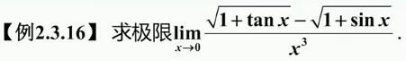
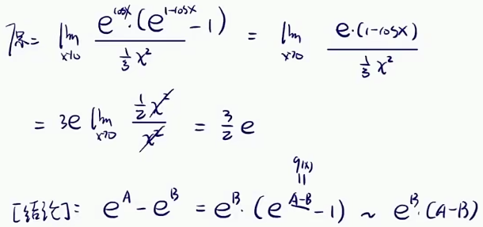

常见的未定式极限

# 四则

不遵循同时性原则，容易犯错误

这题一上来四则不是太好搞还容易犯错误，看了下等价无穷小代换好像也不行，这里洛必达一下试试

到这里，再洛必达就复杂了，用四则的思路拆下式子先，注意拆出来的极限要存在

前面极限显然是1，后面极限可以用等价无穷小代换搞一下

注意极限存在才能拆

注意拆的时候分母极限不为0

②试探原则

实际运算中，拆开后的极限直接看是看不出极限存不存在的，只能够往下算，不存在则说明拆的不对，从头再来即可

把非零因子提出极限简化运算

分析一下非零因子

整理一下原式后再提出非零因子

# 复合函数极限

在算复合函数的极限的时候，看一下外层函数是不是连续函数，绝大部分的情况下都是连续的，外层函数是连续的话，再将极限往内层移动，先求内层的极限，然后再将结果复合一下

外层函数是$$\sqrt{u}$$  

外层函数是$$e^u$$  

# 洛必达

震荡型的，值无法稳定于一个确定的数，极限不存在

幂函数乘以一个对数再求极限，统统都是0

不要一上来就想洛必达，先搞下四则运算找找有没有非零因子，ok了，找找看可不可以等价无穷小代换，到这，再看看能不能化简整理一下，实在没辙了才用洛必达

这题四则好像搞不了，等价无穷小代换是ok的，但这里假设我不会等价无穷小代换或者我压根就没看出来

整个计算过程中，四则还是很好的化简思路

这题化简可以搞一搞，分母这一看根式有理化

还要再强调一下，洛必达不是万能的，下面就出现振荡不存在的结果

对了，可以用四则的思路拆一下式子，拆的时候注意下极限要存在

# 等价无穷小

可以用洛必达法则稍微证明一下

恒等变形稍微处理一下，变成$$e^x-1$$的形式

换底公式处理一下

这6条非常重要，必须记住，而不是想着自己推出来

代换的时候，一不小心就容易被坑

特别强调，纯因式，下面简单辨析一下纯因式

