> 直接计算法
>

正弦函数在无穷远处极限振荡不存在，又正弦函数有界，考虑无穷小✖️有界

* 先裂项整理下式子
* 然后使用指对恒等变形

* 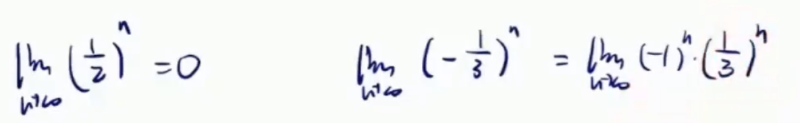
* 
* 

> 海涅归结原理
>

* 目标：化成函数极限求解
* 
* 可以先看一下内层的这个数列它现在趋近于谁
* 假设内层这个数列趋近于$$x_0$$
* 那我只需要算外层的这个函数，x趋近于$$x_0$$时，外层函数的极限
* 外层函数的极限为a，则这个数列的极限也为a

  * 

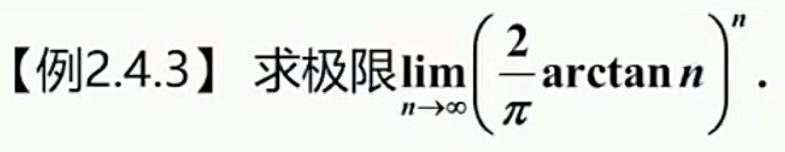

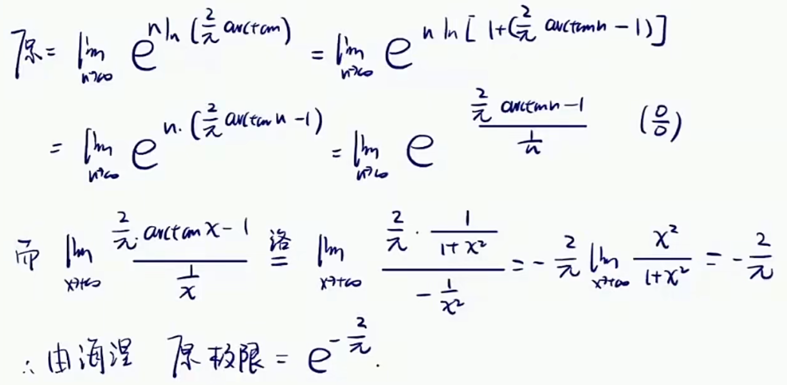

* n趋于∞时，arctan(n)趋于$$\frac{\pi}{2}$$
* 原式极限形式为$1^{\infty}$，采用指对恒等变形的方法。
* 后面老生常谈，ln(1+x)～x，等价无穷小代换。
* 中间可以看到，出现未定式极限，即∞*0，解决方法化成$$\frac {0}{0}$$形式就可以。
* 但需要注意的是，数列是不可以求导的，也就说直接洛必达不能求极限
* 这里用海涅归结原理，n趋于无穷，对应x趋于正无穷

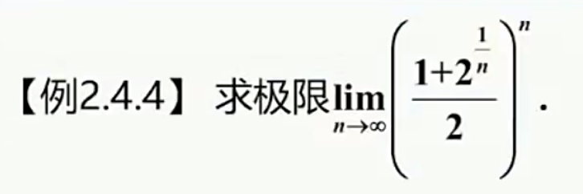

* 这道题其实可以直接求解
* 但这里我们假设只能用海涅归结原理
* 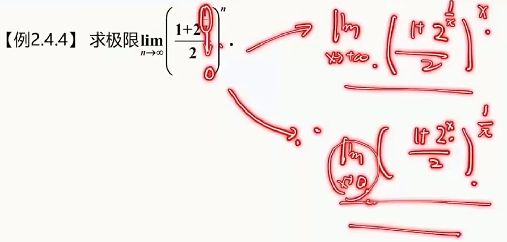
* 有两种处理思路，实际下面的处理方式会更好
* 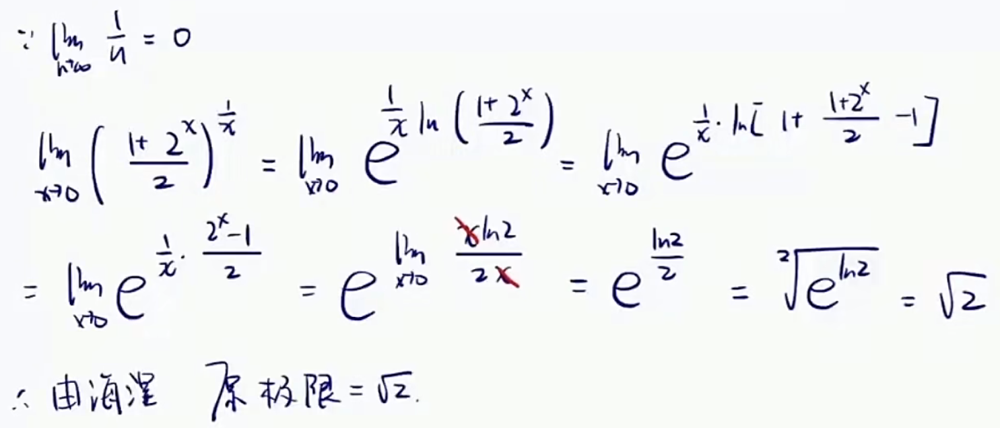
* 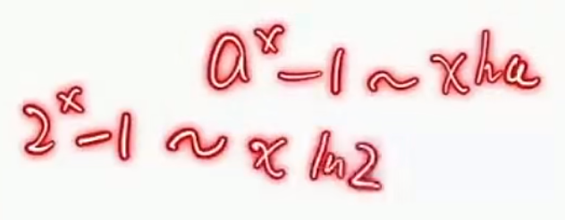

> 夹逼准则
>

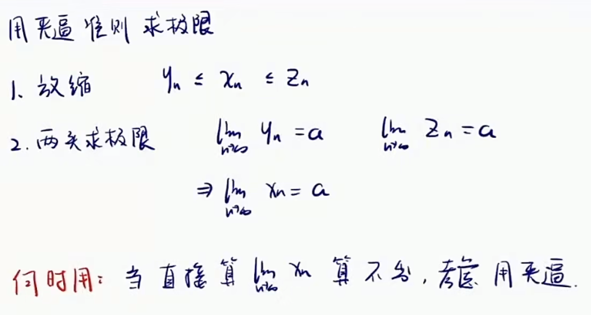

* 两头的极限应该是一致，不一致要么放缩的不对，要么夹逼准则做不了

* 这里乍一看好像可以直接用四则拆开，最后极限加起来为0
* 但仔细想下，四则拆开的条件除了极限存在之外，还得是有限项才可以

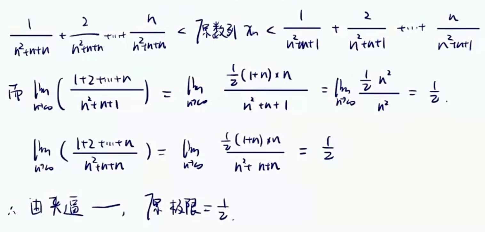

* 左右两头极限一致，说明放缩没问题

* 乍一看，哎，夹逼准则好像可以
* 
* 两头不一致，说明放缩出现问题
* 仔细想下，左头缩的不对，修改如下
* 
* 再进一步思考，当n趋于无穷时，$$c^n$$远小于$$a^n$$
* 换句话说，一开始左头放缩过头了，缩小的太多了
* 显然，在放缩的时候特别注意大头，不要直接就砍了
* 结论：放缩时，放缩次要项
* 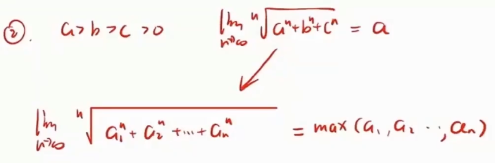

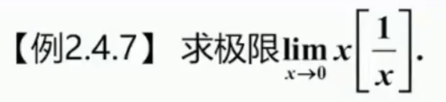

* ∞取整，这取不出来啊

  * 

* 结论，一个数如果要取整数，那么这个数小于这个数本身，大于这个数本身小一个单位

* 题目给出了递推关系

  * 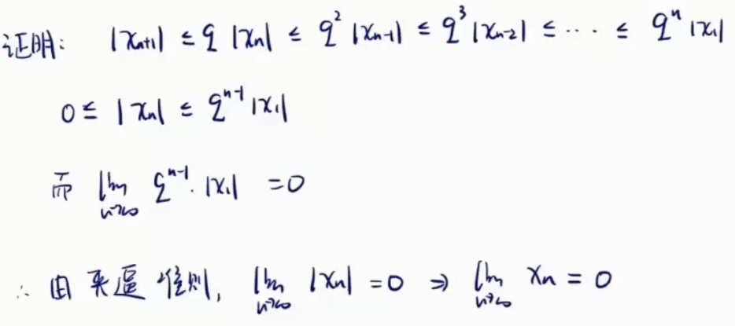

> 用单调有界准则证明数列极限存在
>

* 证明有界性

  * 

* 同理可得

  * 
* 证明单调性

  * 常见的方法，做差跟0比
  * 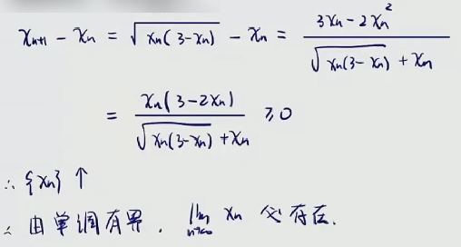
  * 
  * 

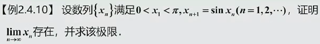

* 单调有界来证明

  * 通过递推关系证明有界性和单调性
  * 
  * 
  * 由于题目特殊性这里直接就能得出单调有界
* 求极限

  * 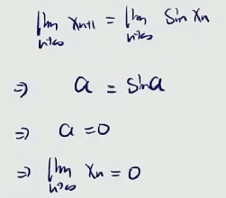

* 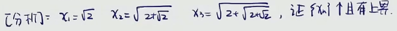
* 证明有界性

  * 在草稿纸上算一下数列的极限
  * 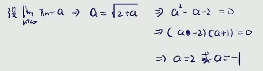
  * 数列是单调递增的，所以a=2
  * 因此数列极限为2
  * 现在只要能证明2为上界
  * 
* 证明单调性

  * 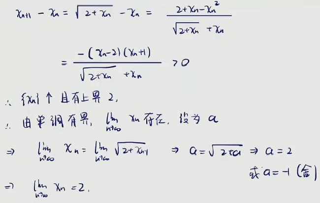

* 
* 证明有界性

  * 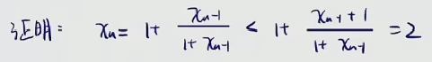
  * 这里稍稍观察了下，增大了分子，得到一个不等式
* 证明单调性

  * 做差

    * 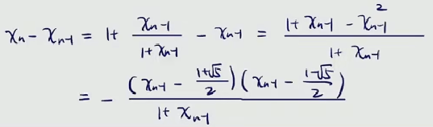
    * 
    * 其它部分都为正，观察这一部分
    * 由于是跟一个(1.5,2)的数比较
    * 而$$x_n$$是小于2的，因而这里做差无法比较
  * 数学归纳法

    * 有兴趣可以试下做商，也证不出来
    * 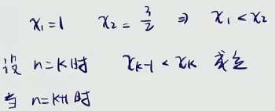
    * 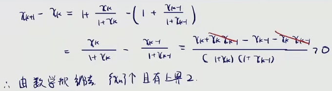
  * 求极限

    * 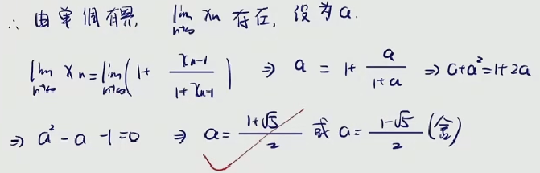
