* 分类

  * 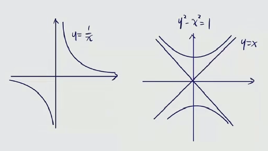

    * 水平、垂直、斜渐近线
  * 水平渐近线

    * 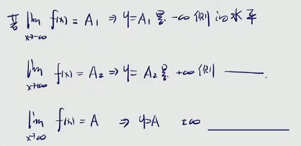
  * 铅直渐近线

    * 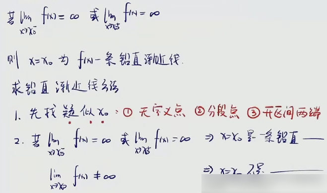
  * 斜渐近线

    * 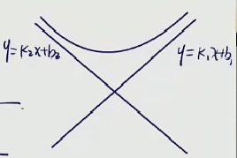

      * 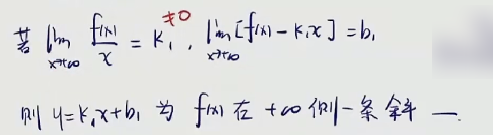
    * 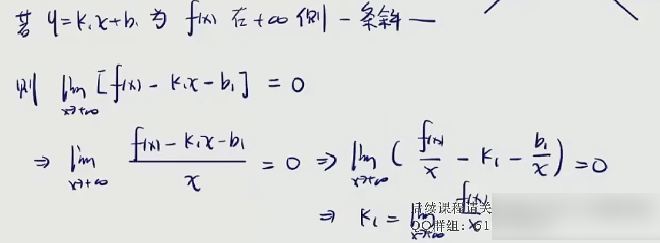
    * 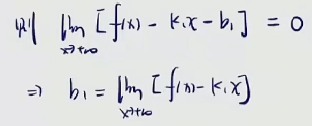
    * 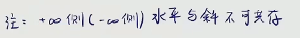
  * 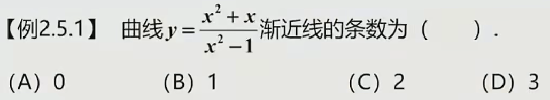

    * 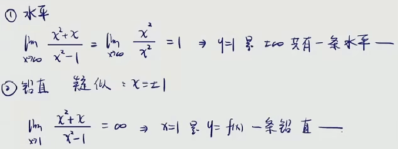
    * 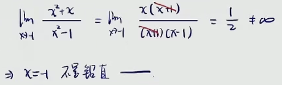
    * 斜渐近线没有，因为image.png[^1]
  * 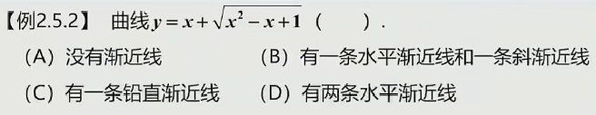

    * 

      * 到这里，洛必达麻烦，抓大头用不了，因为分母不是纯因式
      * 又观察得到分子分母都是幂函数
      * 这里同时除以分子分母的最高次幂
      * 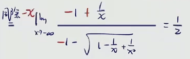

        * 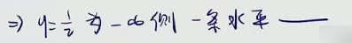
        * 注意是÷-x
        * 如果÷x，又x趋于负的无穷，不可能进根号后还有$$x^2$$
      * 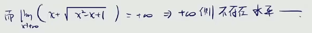
    * ②铅直渐近线

      * 找不到疑似点
    * ③斜渐近线

      * 由于在负无穷处已经有水平渐近线了
      * 因而负无穷处不存在有斜渐近线
      * 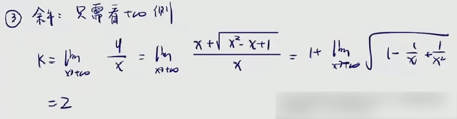
      * 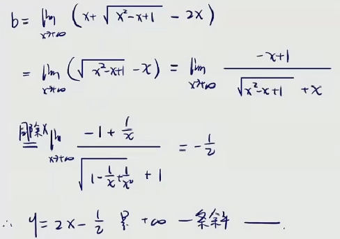
    * 答案选择b
  * 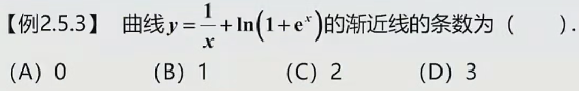

    * 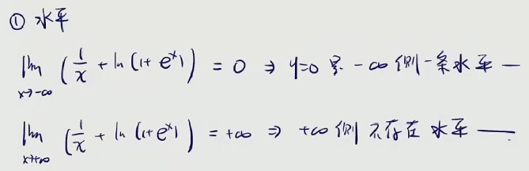
    * 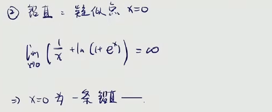
    * ③斜渐近线

      * 由于负无穷处已经存在有水平渐近线
      * 所以负无穷处不存在有斜渐近线
      * 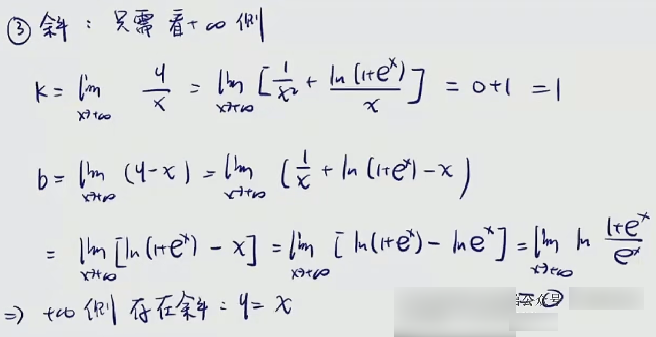

[^1]: * 
