* 基本难度

  * 
  * 
  * 

    * 极限存在，只要极限等于某个数就可以，不一定是$$f(x_0)$$
  * 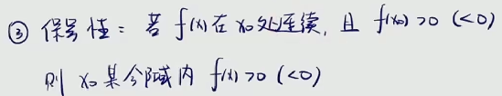
  * 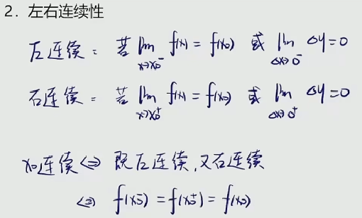
  * 处处连续

    * 你在一个区间上随便给我一个点
    * 这个点处的极限值都跟这个点处的函数值相等的
  * 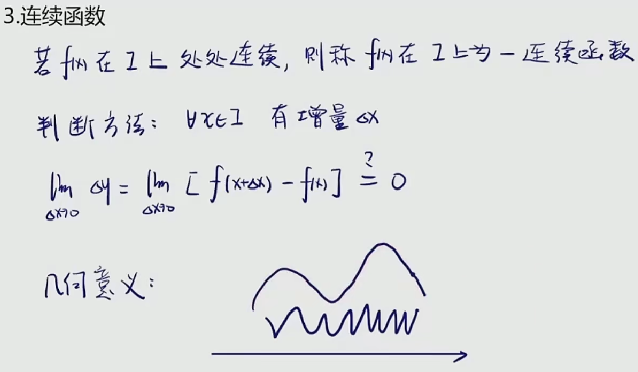

    * 连续不断的曲线
    * 不管变化是剧烈的还是平缓的
  * 

    * 

      * 在给定的区间内，取到一个确切的数x
      * 那么$$e^x$$是一个确切的数
      * 常数去乘以一个无穷小量结果肯定是无穷小量
  * 连续函数的性质

    * 性质一

      * 基本初等函数在定义域内处处连续

        * 高等数学将基本初等函数归为五类： **[幂函数](https://baike.baidu.com/item/%E5%B9%82%E5%87%BD%E6%95%B0/6013227)**  **、**  **[指数函数](https://baike.baidu.com/item/%E6%8C%87%E6%95%B0%E5%87%BD%E6%95%B0/6013301)**  **、**  **[对数函数](https://baike.baidu.com/item/%E5%AF%B9%E6%95%B0%E5%87%BD%E6%95%B0/6013318)**  **、**  **[三角函数](https://baike.baidu.com/item/%E4%B8%89%E8%A7%92%E5%87%BD%E6%95%B0/1652457)**  **、** **[反三角函数](https://baike.baidu.com/item/%E5%8F%8D%E4%B8%89%E8%A7%92%E5%87%BD%E6%95%B0/7004029)** **。**
      * 初等函数在定义区间内处处连续

        * [初等函数](https://baike.baidu.com/item/%E5%88%9D%E7%AD%89%E5%87%BD%E6%95%B0/846442)是由**基本初等函数**经过有限次的[四则运算](https://baike.baidu.com/item/%E5%9B%9B%E5%88%99%E8%BF%90%E7%AE%97/5337481)和[复合](https://baike.baidu.com/item/%E5%A4%8D%E5%90%88/2437031)运算所得到的函数。
        * 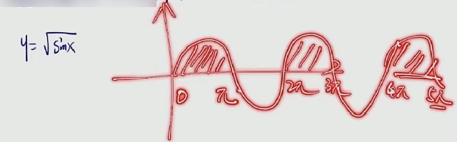

          * 那么我们说它在0到$$\pi$$内处处连续
          * $$2\pi$$到$$3\pi$$内处处连续，以此类推
          * 也就是说它在有定义的区间之内是处处连续的
    * 性质二

      * 连续函数的四则(除法，分母≠0)
      * 结果仍为连续函数
    * 性质三

      * 连续函数反函数也连续
    * 性质四

      * 连续函数之间的复合仍为连续
  * 

    * 
    * 一个函数如果是分段函数的话
    * 它在分段点处的连续性是保证不了的
    * 它有可能是间断点
  * 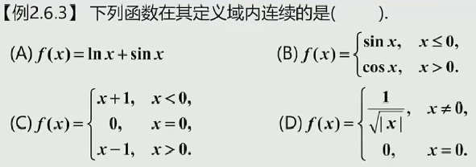

    * a，两个基本初等函数的和应该也是处处连续的
    * 
    * 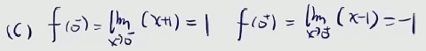
    * 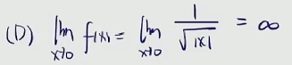

      * 极限都不存在何谈连续
  * 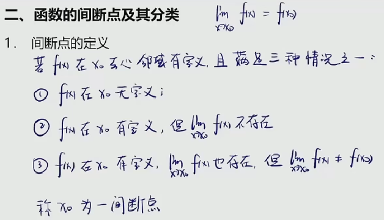
  * 
  * 
  * 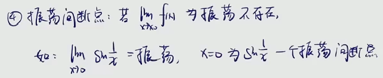

    * 
  * 
  * 

    * 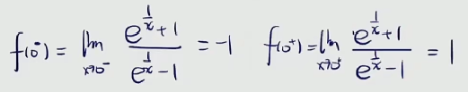
    * 答案选择B
  * 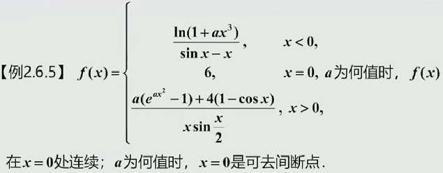

    * 
    * 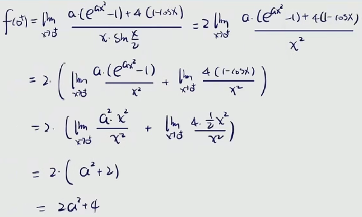
    * 

      * 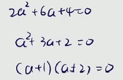
  * 

    * 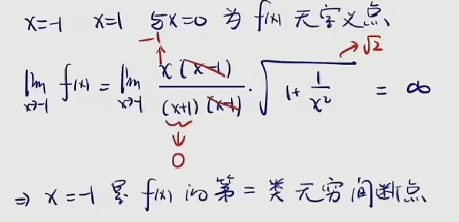
    * 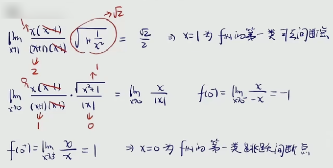
  * 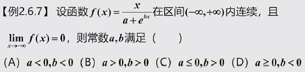

    * 

      * 处处连续说明在给定的区间内没有无定义的点
      * 因而分母不可能取到0
      * 因为一旦分母取到0则表明存在x是无定义的
    * 
  * 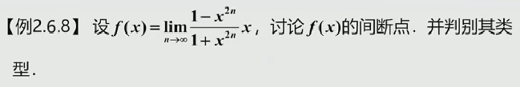

    * 这是比较常见的题型
    * 这是以极限形式给出的函数，它必须先得把极限求出来
    * 这个极限的结果才作为我们函数的表达式
    * 然后才讨论函数的间断点
    * 注意，这个题目中n才是变量，x在这里可以看作一个参数
    * 参数只要讨论对极限的影响，x在求极限的过程中它是不变的
    * 说白了，n才是变化的
    * 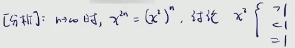
    * 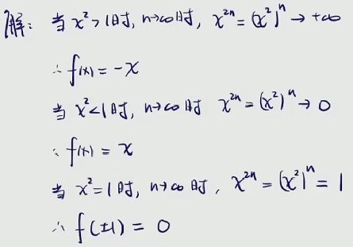

      * 可以看见，求完之后函数是个分段函数
    * 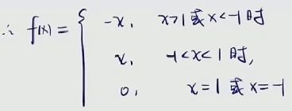

      * 基本初等函数处处连续
      * 那么，间断点这里只可能产生在分段点处
      * 也就是说-1和1
    * 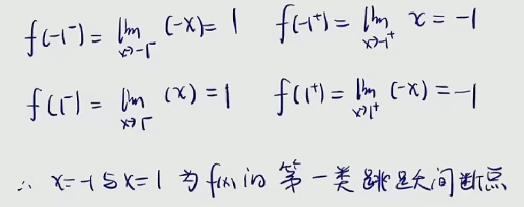
  * 最大值和最小值定理
  * 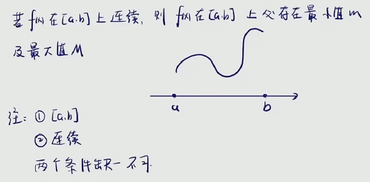

    * 注意，这一定得是闭区间
    * 

      * 这里可以看到，趋于0时是无穷小，取不到最小值
    * 不连续更加不行，说明在区间内可能存在有间断点
  * 

    * 说白了，求一个函数在区间内，存在有x，使得函数等于0
  * 

    * 说白了，求一个函数在区间内，存在有x，使得函数等于c
    * 特别注意ξ的取值范围
    * 零点定理是开区间，取不到两头
    * 介值定理是闭区间，可以取到两头
  * 
  * 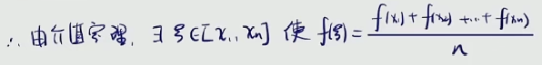

    * 所以说，平均值定理可以看作是介值定理的一个延伸
    * 虽然说平均值定理在考纲之外，但有时候会是解题过程中的重要条件
    * 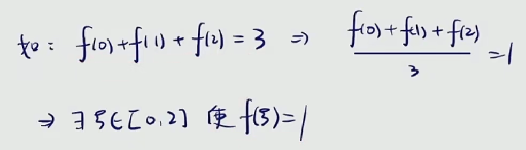
  * 

    * 求一个函数在区间内存在有x，使得函数值为0
    * 很明显，零点定理
    * 初等函数处处连续
    * 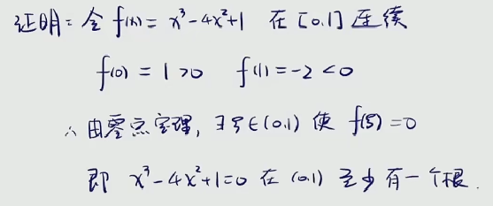

      * 两头异号，函数区间内连续
  * 

    * 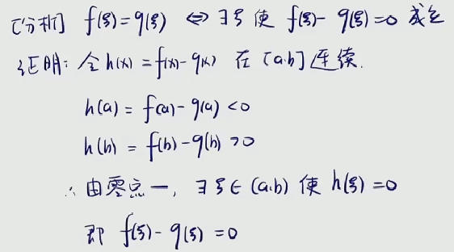

      * 一种常见的处理方式，将函数都整理到一边
  * 

    * 

      * 同样的，将函数都整理到一边
      * 右边一头出现了等于0的情况，不能直接用零点定理
      * 需要分类讨论一下
      * 
  * 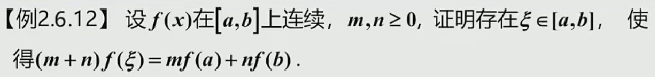

    * 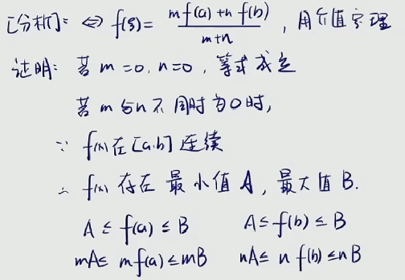
    * 
  * 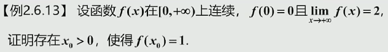

    * 

      * 保序性
      * 说白了，存在有函数值无限接近于极限值2
      * 也就是说，x足够大时，函数值必定大于1
