* 具体难度

  * 
  * 

    * 一个生动的例子
    * 求瞬时速度的过程，利用极限工具很好实现
  * 

    * 定义一
  * 

    * 定义二
  * 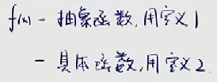
  * 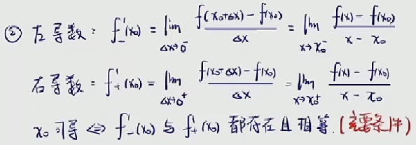
  * 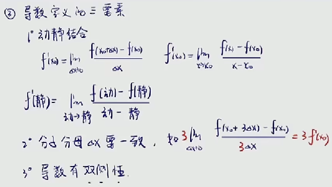
  * 

    * 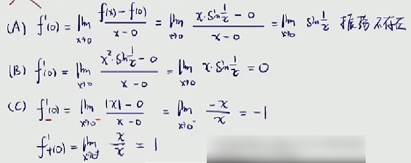

      * c项，我们可以通过图像判断
      * 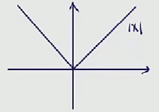
      * 如果曲线在某点处形成了转折型的尖点
      * 那么在尖点处就是不可导的
      * 后面会有证明，这里就不展开说明
    * 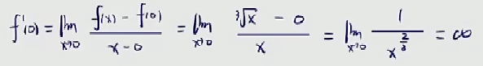

      * 无穷小的倒数是无穷大
    * 所以答案选B
  * 

    * 

      * x是个无穷小量
      * ≠0时，分子分母为同阶无穷小
      * =0时，分子是更为高阶的无穷小
      * 只要分母极限为0，原式极限还存在(重要)
      * 那么分子也应该是一个无穷小(重要)
    * 

      * 所以a项是错误的
    * 

      * 所以b项也是错误的
    * 

      * d项是正确的，c项错误
    * 
    * 我们前面已经知道
    * 对于连续和极限存在，连续的要求更高

      * 连续要求，左右极限相等
      * 同时极限值等于函数值
      * 举个在0处连续的例子

        * 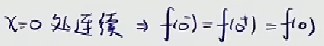
      * 而极限存在只要求左右极限相等
    * 因而连续则极限存在
    * 现在讨论一下，连续和可导的关系

      * 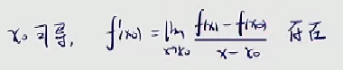
      * 由上面的题目已经知道
      * 分母是无穷小，而原式的极限存在
      * 那么分子要么是同阶的无穷小
      * 要么是更为高阶的无穷小
      * 
      * 
      * 因此证明了可导必定连续
    * 特别注意

      * 连续不一定可导
      * 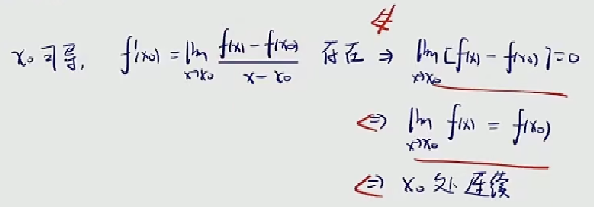
      * $$x_0$$处连续有该点处的极限值等于函数值
      * 往回推两步是可以的，但到第三步就出现问题了
      * 知道分子是无穷小量
      * 也知道分母是无穷小量
      * 那么，我们现在准备求的是无穷小比无穷小的未定式极限
      * 这样一来，原式的极限存在与否是未知的
      * 也就说明了连续不一定可导
  * 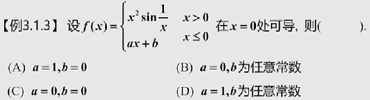

    * 
    * 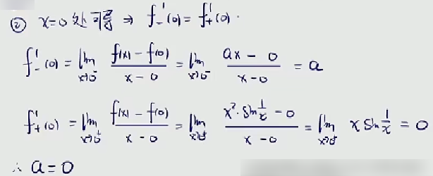
  * 

    * 

      * 想办法去凑导数的形式，由导数的定义
      * 
      * 乍一看，有动点有静点似乎满足要求
      * 现在继续来看一下双侧性
      * 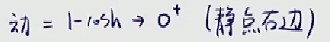

        * 动点只能趋近于静点的右侧
        * 也就是说，只能推出右导数存在
      * 因此不满足导数双侧性的要求
      * 即a项错误
    * 

      * 有动点，有静点
      * 分子分母的Δx一致
      * 现在来看一下双侧性
      * 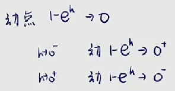
      * 动点确实满足在静点的两侧
      * 即b项正确
    * 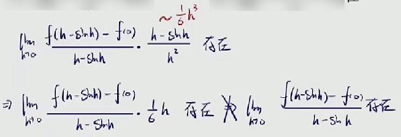

      * 特别注意，这里推不出极限存在
      * 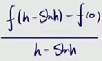

        * 举个例子，假设这一部分是无穷大或者振荡不存在(有界)
        * 为了方便后面讨论作为①式
        * 那么∞(或振荡不存在)去乘以一个无穷小
        * 这样的未定式极限是有可能存在的
        * 但这样一来
        * ①式的极限就不存在了
      * 所以c项错误
    * 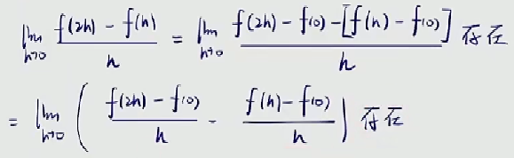

      * 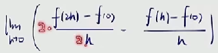
      * 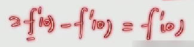

        * 乍一看，欸，把极限拆开再算，好像极限确实存在
        * 难道这题是多选题？
        * 但仔细思考会发现
        * 在运用四则去做运算时有个前提
        * 拆的两部分必须极限存在
        * 而我们现在只能证明它们在一起的时候极限存在
        * 而这两部分单独来看极限
        * 我们是不知道存不存在的
      * 所以d项错误
      * 由d项稍微延伸一下

        * 

          * 像这种存在两个动点的
          * 那么我们在凑导数定义的时候就要凑两个静点
          * 也就是我们这个极限后面要拆成两个
          * 这两个极限合在一起存在
          * 单独每个部分存在吗
          * 我们没办法证明
        * 存在±存在是一定存在的
        * 不存在±不存在是不确定的

          * 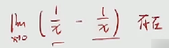
  * 利用导数定义计算变化率型极限

    * 
  * 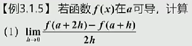

    * 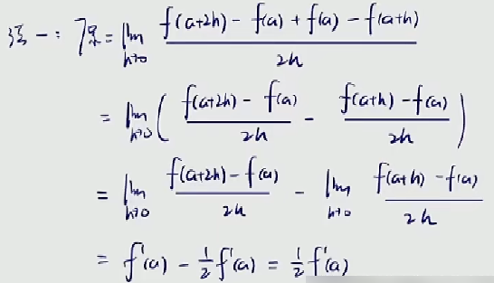

      * 这里由于题干已经说明了a是可导的
      * 又可导必定连续
      * 连续则极限存在
      * 那么这里可以用四则拆成两部分
  * 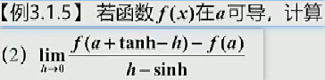

    * 
  * 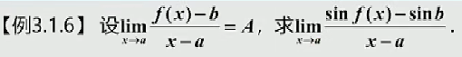

    * 

      * 原式极限等于一个常数
      * 而分母又趋于无穷小
      * 那么分子极限只能趋于无穷小
      * 分子要么是和分母同阶的无穷小
      * 要么是比分母更加高阶的无穷小
      * 这个其实之前已经说明过了，这里重新复习一遍
    * 
    * 

      * 凑导数的定义
      * 
      * 这里是sin这个函数在静点b处的导数
      * 结果是$$cosb$$
  * 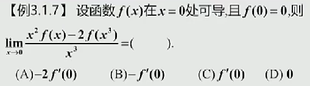

    * 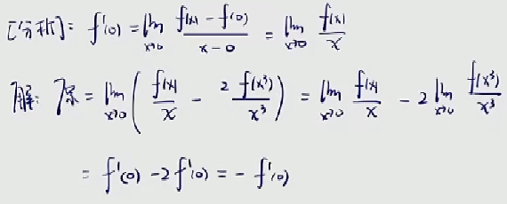

      * 同样的，题干已经给出0处可导
      * 可导必定连续
      * 连续则极限存在
      * 可以用四则运算拆成两部分
  * 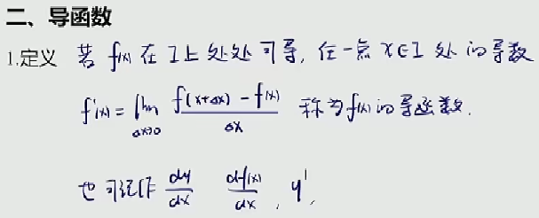
  * 

    * 

      * 导函数的定义
    * 
    * 
  * 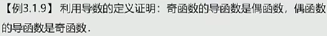

    * 
    * 
    * 
    * 显然，求导改变奇偶性，比如下面例子
    * 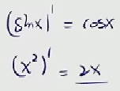
  * 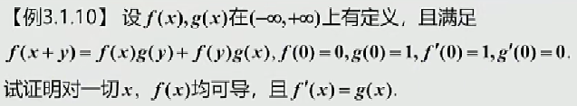

    * 
    * 关键步骤
    * 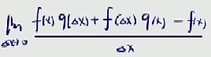

      * 
      * 套用题干给的条件
    * 

      * 自变量是Δx，所以这里f(x)和g(x)看作是常数
      * 剩下的部分想办法凑导数的定义，题干的条件充分利用起来
  * 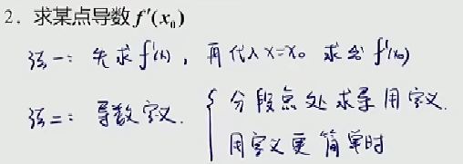
  * 

    * 

      * 默认考虑x≠0的情况
      * 忽略了x=0的情况
    * 

      * 默认考虑x=0的情况
      * 忽略了x≠0的情况
      * 而且，这里有一个误区
      * 当给到的原式是常函数时
      * 其求导才为0
      * 但假如给到的原式不是常函数时
      * 一个函数曲线满足某点处函数值是常数时
      * 该点处求导不一定为0
      * 这种错误千万不要犯
    * 分析题目，0处是函数的分段点
    * 考虑使用导数的定义求解
    * 
    * 关键步骤
    * 

      * 注意，这里的x是无限趋近于0
      * f(x)对应的形式应该是x≠0的情况
  * 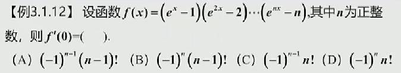

    * 这种乘积形式的，求导起来非常麻烦
    * 考虑使用导数的定义求解
    * 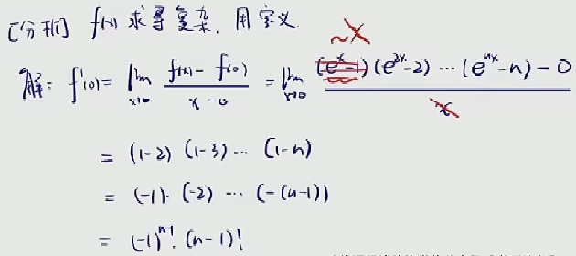
    * 关键步骤
    * 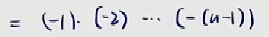

      * 将n-1个-1提取出来
      * 后面剩下的部分很显然是阶乘的形式
  * 
  * 

    * 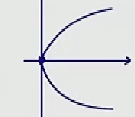
    * 这种铅直的切线是没有斜率的
    * 也就是说不可导
    * 回到之前说过的尖点处不可导
    * 是因为尖点处压根画不出切线
    * 换句话说，一个处处可导的函数
    * 它的曲线是平滑、连续的
    * 因而，可导这里要求比连续更高
  * 

    * 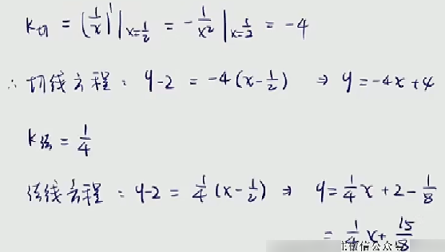

      * 关键步骤
      * 法线斜率与切线斜率乘积为-1
  * 

    * 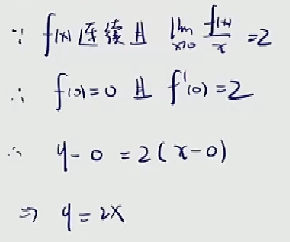

      * 关键步骤
      * 
      * 原式极限结果是常数
      * 分母趋近于无穷小
      * 则分子也应该趋近于无穷小

        * 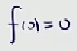
      * 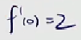
      * 凑导数的定义
  * 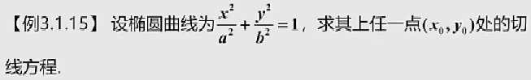

    * 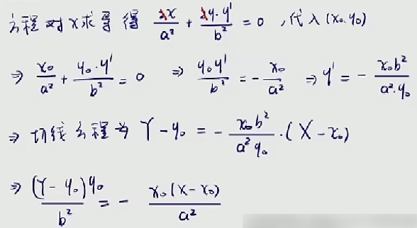
    * 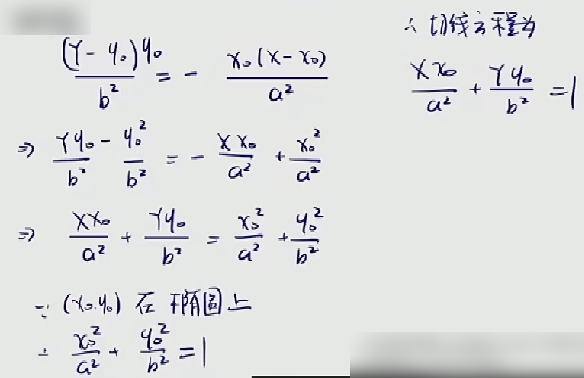

      * 重要结论

        * 
        * 用于求椭圆方程的切线方程
        * 这个式子要记住
        * 我们只要知道任一点坐标就可以很快求得
      * 举例

        * 
