* 开始

  * 
  * 

    * 重点步骤
    * 面积的变化量

      * 大圆的面积减去小圆的面积
    * 
    * 因为$$R_0$$是一个确定的值
    * 所以将上式整体看作一个常数A
    * 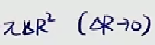
    * 上式可看作ΔR的更高阶的无穷小

      * 
    * 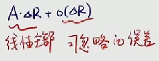

      * 如果一个函数的瞬时变化量
      * 它满足上式结果
      * 也就是一个线性主部加上一个可忽略的误差
      * 我们就叫这个函数在该点处可微
  * 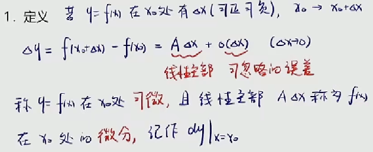

    * 一个函数的瞬时变化量
    * 等于一个线性主部加上一个可以忽略的误差
    * 我们就叫作它`可微`
    * 这个线性主部叫做`微分`
  * 那么，如果我们能够知道A的值的话
  * 函数的变化量Δy就能很容易算出
  * 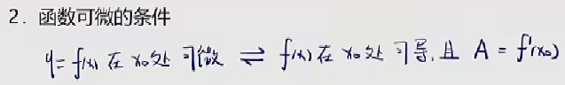

    * `可微`的充要条件是该点可导
    * 而且A的值，就是该点处的导数值
  * 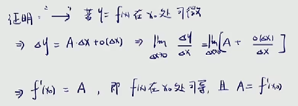

    * 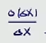
    * 这部分等于无穷小
    * 也就是说
    * `可微`必然可导
  * 

    * 

      * 
      * 为方便讨论将上式记作①
      * 一个函数的极限如果是①
      * 那么我们就可以说这个函数跟①是无限接近的
      * 换句话说这个函数就等于①加上无穷小量
      * 这其实是一个定理
      * 帮助我们去掉极限号
  * 

    * 小小总结
  * 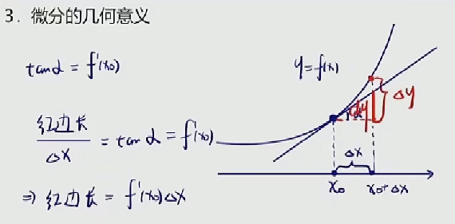

    * 这里的红边长其实就是我们要找的微分
    * 当Δx足够小时
    * $$d_y$$就可以用来近似Δy
  * 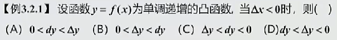

    * 
    * $$d_y$$和Δy向着y轴负方向移动
    * 而Δy的变化量要大于$$d_y$$
    * 因而Δy值小于$$d_y$$值
  * 

    * 题干关键
    * 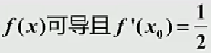
    * 
    * 答案是b选项
  * 

    * 
    * 关键步骤
    * 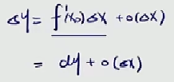
    * 可导必定可微
    * 

      * 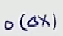
      * 前面有说过
      * 意思是比Δx更为高阶的无穷小
  * 

    * 

      * 连续不一定可导[^1]
    * 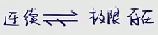

      * 对于连续和极限存在，连续的要求更高[^2]
    * 注意注意
    * 我们现在探讨的是一元函数它们之间的关系
    * 多元函数的情况会比较复杂
  * 

    * 

      * 
      * 分子分母都是幂函数
      * 用四则幂函数的除法
      * a项错误
    * 

      * b项错误
    * 

      * 左右导数相等
      * 即导数存在
      * d项正确，c项错误
  * 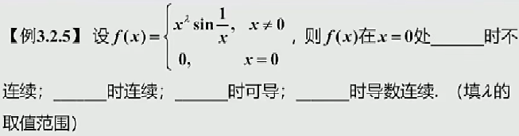

    * 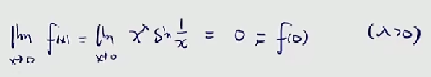

      * 0处的函数值为0
      * 要想连续则极限值也要取0
      * 我们前面已经知道
      * 无穷小乘以一个有界振荡函数它的极限为0
      * 则λ>0时，$$x^{\lambda}$$就等于无穷小量
    * 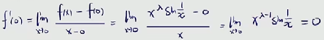

      * λ-1>0时，$$x^{\lambda-1}$$是无穷小量
    * 

      * 导数连续
      * 则导数的极限值等于该点处的函数值
    * 

      * 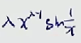

        * λ-1>0
      * 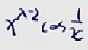

        * λ-2>0
      * 

        * 要求同时满足则λ>2
      * 这里可以看出
      * 某点处可导
      * 只是表示导数存在
      * 而不能表明导数连续

[^1]: * 连续不一定可导
    * 
    * $$x_0$$处连续有该点处的极限值等于函数值
    * 往回推两步是可以的，但到第三步就出现问题了
    * 知道分子是无穷小量
    * 也知道分母是无穷小量
    * 那么，我们现在准备求的是无穷小比无穷小的未定式极限
    * 这样一来，原式的极限存在与否是未知的
    * 也就说明了连续不一定可导

[^2]: * 对于连续和极限存在，连续的要求更高

      * 连续要求，左右极限相等
      * 同时极限值等于函数值
      * 举个在0处连续的例子
    
        * 
      * 而极限存在只要求左右极限相等
